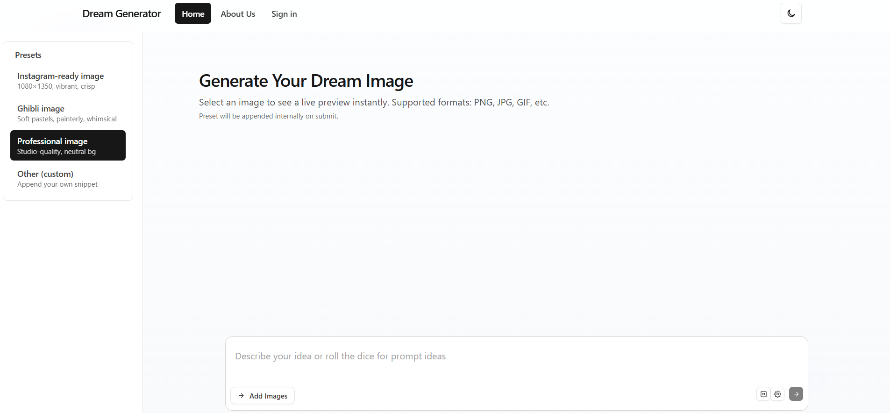

# Dream Image Generator

[](https://nextjs.org/)
[](https://reactjs.org/)
[](https://www.typescriptlang.org/)
[](https://tailwindcss.com/)
[](https://ai.google.dev/)

Dream Image Generator is an interactive web application that transforms user inputs (text prompts and/or reference images) into AI-generated images using Google's Gemini API. It features a clean, responsive UI with preset styles, real-time previews, and easy integration.

## Features

- **Text-to-Image Generation**: Create images from descriptive text prompts.
- **Image-to-Image Transformation**: Upload reference images to guide AI generation.
- **Style Presets**: Quick styles like Instagram-ready, Ghibli-inspired, or professional.
- **Real-Time Preview**: Instant image uploads with validation (size, type, count).
- **Dark Mode Support**: Toggle between light and dark themes.
- **Responsive Design**: Works seamlessly on mobile and desktop.
- **Additional Pages**: About and Sign-in pages for extended functionality.
- **API Integration**: Secure server-side handling of Gemini API calls.

## Tech Stack

- **Framework**: Next.js 14 (App Router)
- **UI Library**: React 18
- **Language**: TypeScript
- **Styling**: Tailwind CSS
- **AI**: Google Gemini API (@google/generative-ai)
- **Build Tools**: PostCSS, npm

## Prerequisites

- Node.js 18+ 
- npm or yarn
- Google Gemini API key (obtain from [Google AI Studio](https://aistudio.google.com/app/apikey))

## Installation

1. Clone the repository:
   ```
   git clone https://github.com/yourusername/dream-image-generator.git
   cd dream-image-generator
   ```

2. Install dependencies:
   ```
   npm install
   ```

3. Set up environment variables: Create a `.env.local` file in the root:
   ```
   NEXT_PUBLIC_GEMINI_API_KEY=your_api_key_here
   ```

4. Run the development server:
   ```
   npm run dev
   ```

5. Open in browser: [http://localhost:3000](http://localhost:3000)

## Usage

- **Home Page**: Enter a text prompt, optionally upload images (up to 5, max 5MB each), select a preset, and generate.
- **Presets**: Choose from sidebar (desktop) or menu (mobile) to append style-specific instructions internally.
- **Generation**: Click submit to process via Gemini API; view results with download options.
- **About Page**: Learn more about the app.
- **Sign-in Page**: Placeholder for authentication.

## Project Structure

```
dream-image-generator/
├─ app/                    # App Router pages and layouts
│  ├─ layout.tsx          # Root layout with global styles
│  ├─ page.tsx            # Home page with main functionality
│  ├─ about/page.tsx      # About page
│  ├─ sign-in/page.tsx    # Sign-in page
│  ├─ api/generate/route.ts # API route for Gemini integration
│  └─ globals.css         # Global CSS with Tailwind
├─ components/             # Reusable React components
│  ├─ Header.tsx          # Navigation header
│  ├─ ImageUploader.tsx   # Image upload and prompt input
│  ├─ SidebarPresets.tsx  # Preset selection sidebar
│  └─ ThemeToggle.tsx     # Dark mode toggle
├─ memory-bank/            # Documentation files (internal)
├─ public/                 # Static assets (if any)
├─ .gitignore
├─ env.d.ts               # Environment types
├─ package.json           # Dependencies and scripts
├─ postcss.config.js      # PostCSS config
├─ README.md              # This file
├─ tailwind.config.js     # Tailwind configuration
└─ tsconfig.json          # TypeScript configuration
```

## Scripts

- `npm run dev`: Start development server
- `npm run build`: Build for production
- `npm start`: Start production server
- `npm run lint`: Run ESLint

## Contributing

1. Fork the repo
2. Create a feature branch (`git checkout -b feature/amazing-feature`)
3. Commit changes (`git commit -m 'Add amazing feature'`)
4. Push to the branch (`git push origin feature/amazing-feature`)
5. Open a Pull Request

## License

This project is licensed under the ISC License. See [LICENSE](LICENSE) for details.

## Acknowledgments

- Built with Next.js and React
- Powered by Google Gemini API
- Styled with Tailwind CSS

For questions or issues, open a GitHub issue.
